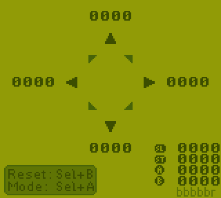

# Game Boy / Analogue Pocket Button Test

A small ROM that allows you to test buttons, the D-Pad in particular.

Supported consoles:
 - Game Boy / Game Boy Color (.gb)
 - Analogue Pocket (.pocket)
 - MegaDuck / Cougar Boy (.duck)

The counter readouts are in hexidecimal

Options:
* Select + B: Reset all counters
* Select + A: Change Mode (4-Way or 8-Way)

Also on  [itch.io](https://bbbbbr.itch.io/game-boy-button-test)

Building: Requires GBDK-2020 4.1.0 (For older versions of GBDK-2020 `Makefile.targets` needs `PORT=gbz80` instead of `PORT=sm83`)
